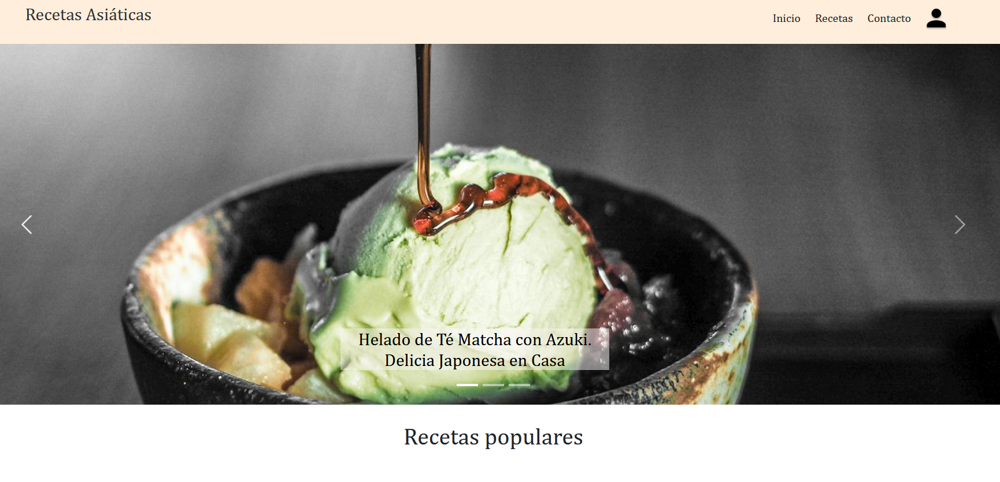

# CRUD-project
## Blog de Recetas Asiáticas

   

La idea de este proyecto es desarrollar una página web de recetas asiáticas con CRUD para cada una de las recetas.

En este proyecto se trabajó con una base de datos en my SQL de manera local.

Se ha hecho dos carpetas para el back y el front del proyecto.

El proyecto es una versión simplificada de una toma de contacto sencilla con CRUD y las bases de datos, por lo que no se le ha añadido de momento muchas mas funcionalidades.

Se podría usar la estructura del proyecto como plantilla para probarlo con una base de datos propia en local, teniendo en cuenta sus campos para modificarlo y poner el mismo.

## Instrucciones
Si te descargas el proyecto debes tener en cuenta que debes instalarte varios paquetes.
Si no tienes node, debes ir a descargarlo a su página 👉https://nodejs.org/en

Una vez instalado Node.js ya puedes pasar a lo siguiente.

En la terminal, en tu carpeta node (back):

**npm init -y (para el node y packages)**

**npm i cors mysql sequelize**

**npm install --save-dev nodemon**

**npm install express**

para levantar el servidor del back, en la terminal se escribe:

**nodemon app**

En la terminal, en tu carpeta front:

**npm init -y** (para el node y packages)

**npm install react react-dom**

**npm install multer**

para ver el proyecto:

**npm start** 

Para visualizar algunos elementos de bootstrap, asegurate de tener instalado esta depedencia:

**npm install bootstrap**

## Mi contacto

   

